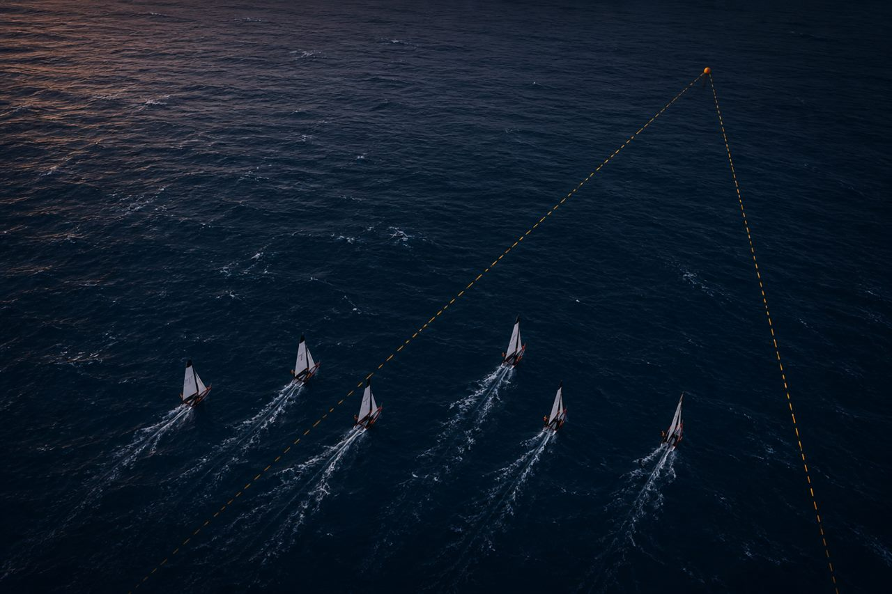
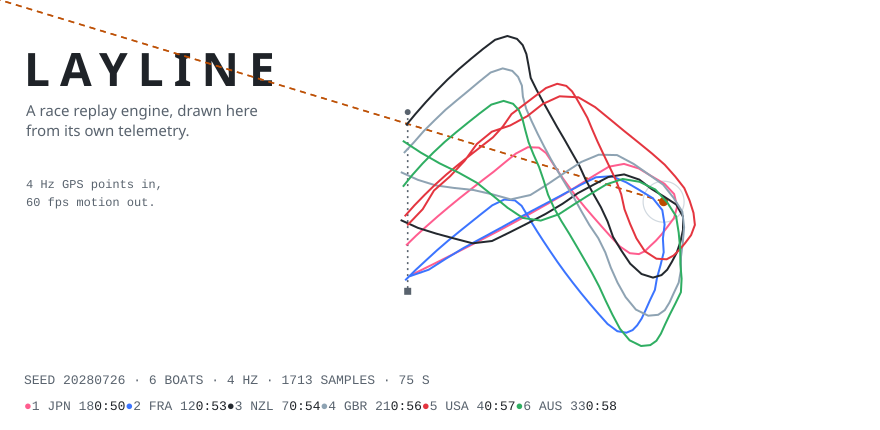
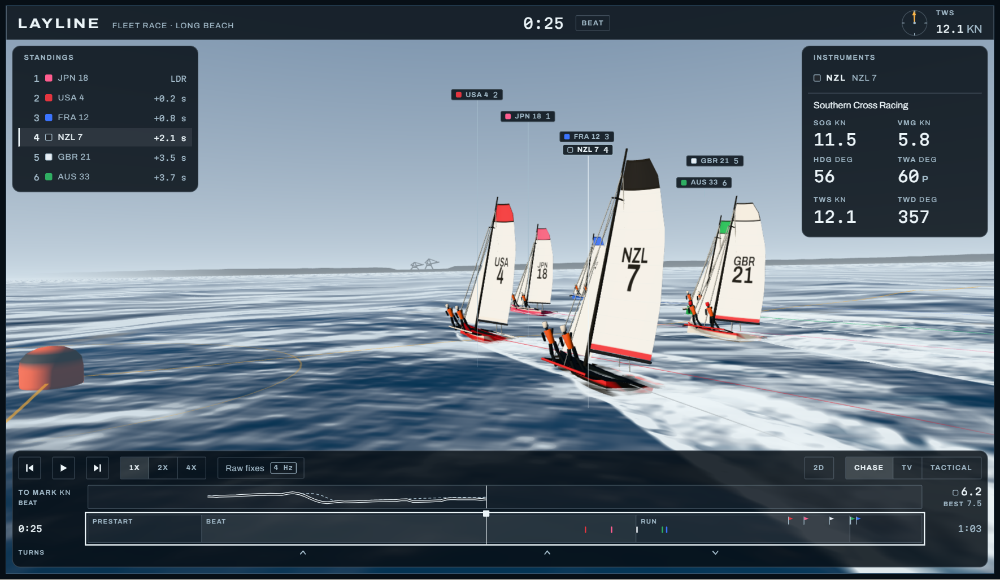
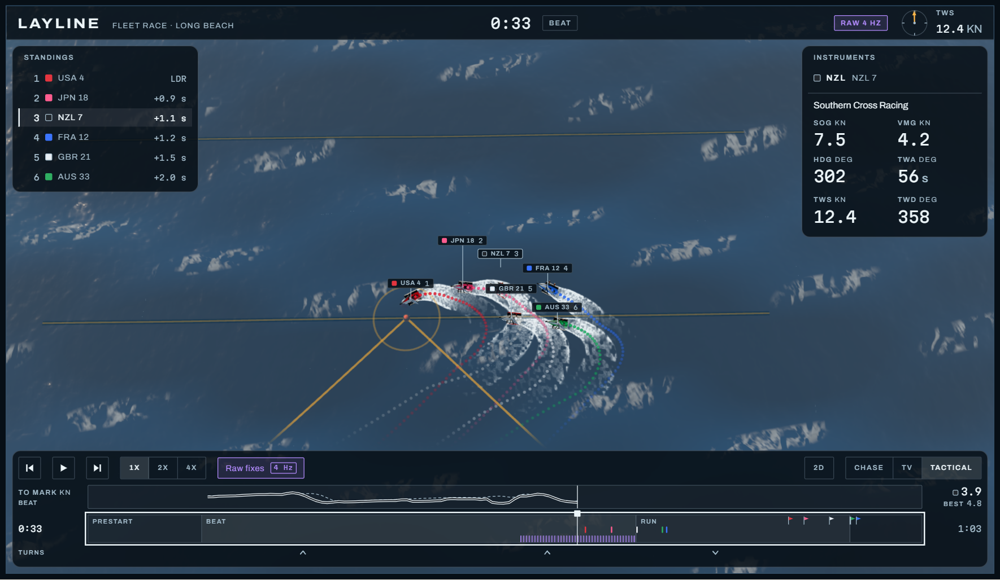
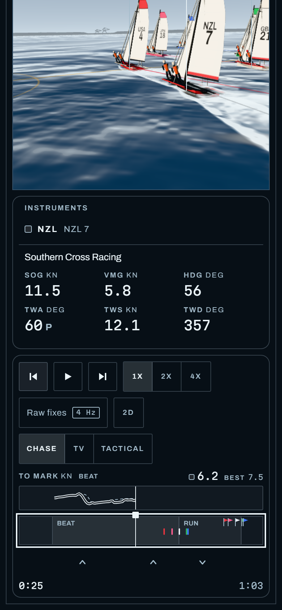
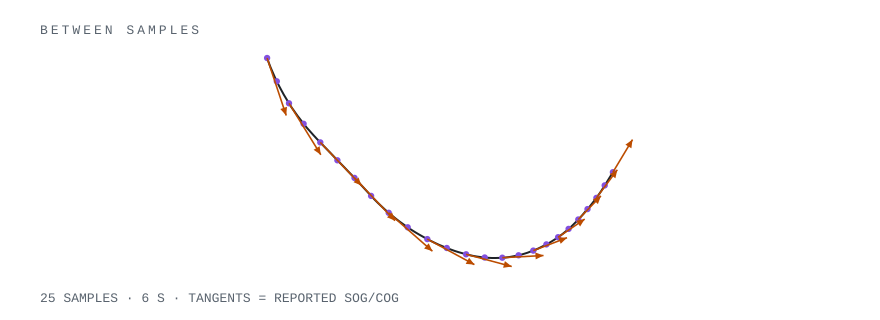
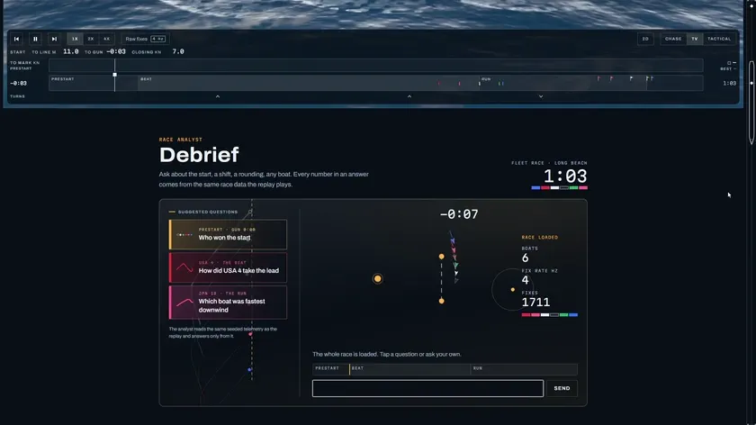

<!-- generated by scripts/readme/build.mts. do not edit by hand. -->

<a href="https://fullbuild.ai/prototype/layline"></a>

# Layline

**[Open the live demo](https://fullbuild.ai/prototype/layline)**

Layline replays a six-boat sailing race in the browser. A tracker reports each boat's position 4 times per second. Layline fills the 250 ms gaps and draws the race at display rate.

You can follow any boat, change cameras, scrub the race, inspect the raw fixes, and step through each reading. Debrief answers questions using 7 tools that read the same race data.

<picture>
<source media="(max-width: 500px) and (prefers-color-scheme: dark)" srcset="assets/course-narrow-dark.svg">
<source media="(max-width: 500px)" srcset="assets/course-narrow-light.svg">
<source media="(prefers-color-scheme: dark)" srcset="assets/course-dark.svg">

</picture>

## Run locally

```bash
npm install
npm run dev
```

Open http://localhost:3000. Requires Node 20 or newer.

The app needs no database and fetches no race data. It generates the same race on the server and in the browser from seed `20280726`.

Recommended to view on https://fullbuild.ai/prototype/layline

## Replay

<a href="https://fullbuild.ai/prototype/layline"></a>

<table>
<tr>
<td width="62%"><a href="https://fullbuild.ai/prototype/layline"></a></td>
<td width="38%"><a href="https://fullbuild.ai/prototype/layline"></a></td>
</tr>
</table>

- Chase, TV, tactical, and 2D course views.
- Playback at 1x, 2x, or 4x.
- Scrubbing and 250 ms frame stepping.
- Raw fixes mode shows the tracker input without interpolation.
- Clicking a standings row follows that boat and opens its instruments.
- Tack and gybe markers seek to each turn and show the speed lost.
- Start data shows time to the gun, distance to the line, and closing speed.
- Speed made good compares the followed boat with the fleet at the same time.

## How the motion works

A tracker sends one fix every 250 ms. A 60 Hz screen draws 15 frames during that gap. Holding each fix for all 15 frames makes the boat jump.

<picture>
<source media="(max-width: 500px) and (prefers-color-scheme: dark)" srcset="assets/hermite-narrow-dark.svg">
<source media="(max-width: 500px)" srcset="assets/hermite-narrow-light.svg">
<source media="(prefers-color-scheme: dark)" srcset="assets/hermite-dark.svg">

</picture>

**<ins>[interpolate.ts](src/lib/layline/interpolate.ts)</ins>** fills each gap with a cubic Hermite curve. The boat's reported speed and course set the direction at both ends. The curve passes through every recorded fix while keeping the shape of tacks and roundings.

- Angles take the shortest path around the compass.
- Turn rate is capped at 60 degrees per second.
- The gennaker value stays between 0 and 1.
- Before the first fix and after the last fix, the boat holds position.

The same evaluator supplies the 3D scene, instruments, standings, and 2D course. Every view gets the same result for the same race time.

The simulator runs at 20 Hz, then keeps only the data a 4 Hz tracker would send. The current seed produces 1711 fixes across 6 boats and 73 seconds.

## Debrief

<a href="assets/video/debrief.webm"></a>

The loop shows the first answer. The linked [22-second recording](assets/video/debrief.webm) shows two suggested questions answered in full.

Debrief reads the same `RaceData` as the replay. Its 7 tools cover standings, boat state, boat comparisons, maneuvers, starts, wind, and sailing terms. Each cited moment becomes a button that seeks the replay and follows the named boat.

<picture>
<source media="(max-width: 500px) and (prefers-color-scheme: dark)" srcset="assets/debrief-narrow-dark.svg">
<source media="(max-width: 500px)" srcset="assets/debrief-narrow-light.svg">
<source media="(prefers-color-scheme: dark)" srcset="assets/debrief-dark.svg">

</picture>

Responses stream through server-sent events. Status messages identify each tool call before answer text arrives.

A marker such as `[[t=32.9|nzl]]` links an answer to a boat and race time. The client waits for the complete marker before drawing the button.

The route limits requests to the same origin, 8 turns of history, 400 characters per message, and four tool rounds. It also rate-limits each app instance. Missing live-model settings return `503` and hide Debrief.

## Performance

- Per-frame code reuses pose objects, search cursors, and the standings array.
- Instrument text updates only when a value changes.
- The water uses 27,009 vertices. A uniform grid at the same detail would use 1,640,961.
- The fleet shares two hull materials. Spray and raw fix dots use instancing.
- Sustained frame misses lower the pixel ratio one step at a time.

## Controls

| Input | Action |
| --- | --- |
| Play and step buttons | Play, pause, or move one fix |
| `ArrowLeft` / `ArrowRight` | Move one second |
| `Shift` with arrow keys | Move ten seconds |
| `,` / `.` | Move one 250 ms fix |
| `Home` / `End` | Jump to the start or end |
| 1x / 2x / 4x | Set playback speed |
| Raw fixes | Show recorded fixes without interpolation |
| Chase / TV / Tactical | Change camera |
| 2D | Open the course view |
| Maneuver marker | Seek to a tack or gybe |
| Standings row | Follow a boat |
| Debrief moment | Seek to the cited time and boat |

## Tests

```bash
npm test
```

The 50 tests cover seeded race output, exact fixes, interpolation, compass wrapping, turn-rate limits, sail bounds, standings, frame stepping, and display formatting.

Debrief tests cover tool output, maneuver detection, moment markers, glossary lookup, request validation, and mock streaming.

## Data and license

The race is fictional. It depicts no real boats, teams, or venues.

[`scripts/readme/build.mts`](scripts/readme/build.mts) generates this README. It recomputes race numbers from the simulator and fails if they no longer match.

[MIT](LICENSE)
